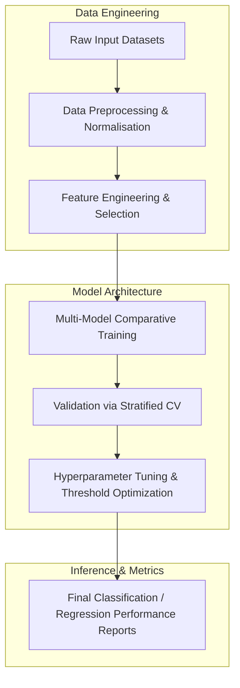

# BT57 — AI-Powered Research Infrastructure Optimizer: Intelligent Lab Resource Allocation & Experiment Scheduling

[](https://creativecommons.org/licenses/by-nc-nd/4.0/)


This repository implements the research pipeline for the **BT57 — AI-Powered Research Infrastructure Optimizer: Intelligent Lab Resource Allocation & Experiment Scheduling** project, developed by the Runtime-Slayers research group.

---

## 📊 Pipeline Architecture

The flowchart below visualizes the methodology and execution sequence implemented in this project:



---

## 🔍 Abstract & Research Context


---

## 📊 Key Evaluation Metrics

| Stakeholder | Pain Point |
|---|---|
| Graduate students | 4-8 hours/week lost to scheduling conflicts |
| PIs (Principal Investigators) | Cannot maximize lab output per dollar |
| Lab managers | Manual scheduling is error-prone and unfair |
| Departments | Equipment ROI is untracked |
| Funding agencies | Cannot assess if funded infrastructure is fully utilized |

---

## 📁 Repository Structure

The project directory consists of the following core structures:
  - `code/` — Pipeline execution scripts and model training modules
  - `figures/` — Plots, charts, and visualizations generated by the pipeline
  - `validation/` — Automated test metrics and results
  - `figures_p55`
  - `test_p55_real_data.py`
  - `BT57_AI_Lab_Infrastructure.md`
  - `BT55_Solar_Air_Quality.md`
  - `paper.pdf` — Compiled research manuscript
  - `README.md` — Project documentation and setup guide

---

## 🚀 Setup and Usage

### Prerequisites
* Python 3.8 or higher
* Pip package manager

### Installation
1. Clone this repository:
   ```bash
   git clone https://github.com/Runtime-Slayers/AI-Lab-Infrastructure-Optimizer-Resource-Scheduling.git
   cd AI-Lab-Infrastructure-Optimizer-Resource-Scheduling
   ```
2. Install dependencies:
   ```bash
   pip install -r requirements.txt
   ```

### Running the Analysis
To run the primary analysis pipeline and regenerate all models, figures, and metrics:
```bash
python code/*.py
```
*(Look in the `code/` directory for specific pipeline execution files)*

---

## 📄 License and Copyright

This work is licensed under a [Creative Commons Attribution-NonCommercial-NoDerivatives 4.0 International License](https://creativecommons.org/licenses/by-nc-nd/4.0/).

© 2026 Runtime-Slayers / Bhavanam Rajendra Reddy et al. All rights reserved.
